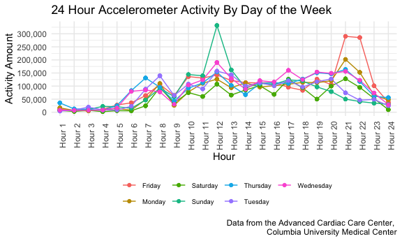

P8105 Homework 3 - Tanya Butt (thb2114)
================

## Problem 1

First, I will load the the Instacart data from the p8105.datasets
library and evaluate its contents.

``` r
data("instacart")
force(instacart)
instacart %>% 
  count(user_id)
```

The Instacart data is an online grocery shopping dataset from 2017. It
includes the following 15 variables: order\_id, product\_id,
add\_to\_cart\_order, reordered, user\_id, eval\_set, order\_number,
order\_dow, order\_hour\_of\_day, days\_since\_prior\_order,
product\_name, aisle\_id, department\_id, aisle, department.

The data has 1384617 observations. Each row is a product from a single
order from 131209 unique individuals.

I will now produce some graphs using the Instacart data.

``` r
instacart %>% 
  count(department, name = "department_id") %>% 
  ggplot(aes(x = department, y = department_id)) +
  geom_point() +
  labs(
    title = "Number of Products Ordered by Department ",
    x = "Department",
    y = "Number of Prodcuts Ordered",
    caption =  "Data from Instacart"
  ) +
  theme(axis.text.x = element_text(angle = 90)) +
  scale_y_continuous(labels = scales::comma)
```


The departments most frequently ordered from in this dataset set are
“produce” and “dairy eggs”.

``` r
instacart %>% 
  group_by(department, product_name) %>% 
  summarize(n_obs = n()) %>% 
  filter(n_obs > 5000) %>% 
  ggplot(aes(x = product_name, y = n_obs)) +
  geom_bar(stat = "identity", fill = "steelblue") +
  labs(
    title = "Top 10 Products Ordered in the Instacart Dataset",
    x = "Product Name",
    y = "Number of Prodcuts Ordered",
    caption =  "Data from Instacart"
  ) +
  theme(axis.text.x = element_text(angle = 90)) +
  scale_y_continuous(
    breaks = c(0, 5000, 10000, 15000, 20000),
    labels = c("0", "5,000", "10,000", "15,000", "20,000")) +
  scale_x_discrete(labels = function(x) stringr::str_wrap(x, width = 10))
## `summarise()` has grouped output by 'department'. You can override using the `.groups` argument.
```


The top 10 most frequently ordered products in the Instacart dataset are
bags of organic bananas, bananas, large lemons, limes, organic avocados,
organic baby spinach, organic Has avocados, organic raspberries, organic
strawberries, and strawberries.

``` r
n_distinct(pull(instacart, aisle_id))
## [1] 134
instacart %>% 
  count(aisle_id, aisle, sort = TRUE)
## # A tibble: 134 × 3
##    aisle_id aisle                              n
##       <int> <chr>                          <int>
##  1       83 fresh vegetables              150609
##  2       24 fresh fruits                  150473
##  3      123 packaged vegetables fruits     78493
##  4      120 yogurt                         55240
##  5       21 packaged cheese                41699
##  6      115 water seltzer sparkling water  36617
##  7       84 milk                           32644
##  8      107 chips pretzels                 31269
##  9       91 soy lactosefree                26240
## 10      112 bread                          23635
## # … with 124 more rows
```

In the Instacart dataset, the number of aisles are 134 and the aisles
most ordered from are the ‘fresh vegetables’ and ‘fresh fruits’ aisle.

Below is a bar graph of the number of items ordered in aisles with &gt;
10,000 items ordered.

``` r
instacart %>% 
  count(aisle_id, aisle, sort = TRUE) %>% 
  filter(n > 10000) %>% 
  ggplot(aes(x = aisle, y = n)) +
  geom_bar(stat = "identity", fill = "steelblue") +
  labs(
    title = "Number of Products Ordered",
    x = "Aisle Name",
    y = "Number of Prodcuts Ordered",
    caption =  "Data from Instacart"
  ) +
  theme(axis.text.x = element_text(angle = 90, hjust = 1.05, size = 8)) +
  scale_y_continuous(
    breaks = c(0, 10000, 20000, 40000, 60000, 80000, 100000, 120000, 140000,
               160000),
    labels = c("0", "10,000", "20,000", "40,000", "60,000", "80,000", "100,000", 
               "120,000", "140,000", "160,000")) 
```


‘Fresh vegetables’ and ‘fresh fruits’ had the highest number of orders
in this dataset.

Below I will create a table with the three most popular items in each of
the aisles, “baking ingredients”, “dog food care”, and “packaged
vegetable fruits.” I will include the number of times each item is
ordered in the table.

``` r
baking_df = filter(instacart, aisle == "baking ingredients") %>% 
  group_by(aisle, product_name) %>% 
  count(product_name, sort = TRUE) %>% 
  filter(product_name == "Light Brown Sugar" | product_name == "Pure Baking Soda" |
         product_name == "Cane Sugar") 

dogfood_df = filter(instacart, aisle == "dog food care") %>% 
  group_by(aisle, product_name) %>% 
  count(product_name, sort = TRUE) %>% 
  filter(product_name == "Snack Sticks Chicken & Rice Recipe Dog Treats" | 
           product_name == "Organix Chicken & Brown Rice Recipe" | product_name
         == "Small Dog Biscuits")

package_vege_fruit_df = filter(instacart, aisle == "packaged vegetables fruits") %>% 
  group_by(aisle, product_name) %>% 
  count(product_name, sort = TRUE) %>% 
  filter(product_name == "Organic Baby Spinach" | product_name == "Organic Raspberries" |
           product_name == "Organic Blueberries")

package_baking_df = full_join(package_vege_fruit_df, baking_df, by = NULL) 
## Joining, by = c("aisle", "product_name", "n")
baking_dogfood_package_df = full_join(package_baking_df, dogfood_df, by = NULL) %>%
  group_by(aisle) %>% 
  mutate(n, rank = min_rank(desc(n))) %>%
  mutate(product_order_num = paste(product_name,"- number of orders:", n)) 
## Joining, by = c("aisle", "product_name", "n")
table_df = select(baking_dogfood_package_df, rank, product_order_num, aisle) %>% 
  pivot_wider(
    names_from = aisle,
    values_from = product_order_num) %>% 
  rename("Rank" = rank) %>% 
  rename("Packaged Vegetables and Fruits" = `packaged vegetables fruits`) %>% 
  rename("Baking Ingredients" = `baking ingredients`) %>% 
  rename("Dog Food and Care" = `dog food care`) %>% 
   knitr::kable()

table_df
```

| Rank | Packaged Vegetables and Fruits                | Baking Ingredients                        | Dog Food and Care                                                    |
|-----:|:----------------------------------------------|:------------------------------------------|:---------------------------------------------------------------------|
|    1 | Organic Baby Spinach - number of orders: 9784 | Light Brown Sugar - number of orders: 499 | Snack Sticks Chicken & Rice Recipe Dog Treats - number of orders: 30 |
|    2 | Organic Raspberries - number of orders: 5546  | Pure Baking Soda - number of orders: 387  | Organix Chicken & Brown Rice Recipe - number of orders: 28           |
|    3 | Organic Blueberries - number of orders: 4966  | Cane Sugar - number of orders: 336        | Small Dog Biscuits - number of orders: 26                            |

The most ordered items in the “Packaged Vegetables and Fruits”, “Baking
Ingredients”, and “Dog Food and Care” aisles are: organic baby spinach,
light brown sugar, and Snack Sticks Chicken and Rice Recipe Dog Treats.

In the following code, I am creating a table to show the mean hour of
the day at which Pink Lady Apples and Coffee Ice Cream are ordered on
each day of the week.

``` r
PLA_CIC_df = filter(instacart, product_name == "Pink Lady Apples" | product_name
                    == "Coffee Ice Cream") %>% 
  group_by(product_name, order_dow) %>% 
  summarize(mean_order_hour = mean(order_hour_of_day)) %>% 
  rename("Name of Product" = product_name) %>% 
  rename("Mean Order Hour" = mean_order_hour) %>%
  mutate(order_dow = factor(c("0" = "Sunday", "1" = "Monday", "2" = "Tuesday",
                              "3" = "Wednesday", "4" = "Thursday", "5" = "Friday",
                              "6" = "Saturday"))) %>% 
  pivot_wider(
    names_from = "order_dow",
    values_from = "Mean Order Hour"
  ) %>% 
  knitr::kable()
## `summarise()` has grouped output by 'product_name'. You can override using the `.groups` argument.
PLA_CIC_df        
```

| Name of Product  |   Sunday |   Monday |  Tuesday | Wednesday | Thursday |   Friday | Saturday |
|:-----------------|---------:|---------:|---------:|----------:|---------:|---------:|---------:|
| Coffee Ice Cream | 13.77419 | 14.31579 | 15.38095 |  15.31818 | 15.21739 | 12.26316 | 13.83333 |
| Pink Lady Apples | 13.44118 | 11.36000 | 11.70213 |  14.25000 | 11.55172 | 12.78431 | 11.93750 |

Based on the table, it looks like Pink Lady Apples tend to be ordered
earlier in the day compared to Coffee Ice Cream.

## Problem 2

I will load and clean data from the “Behavioral Risk Factors
Surveillance System (BRFSS) for Selected Metropolitan Area Risk Trends
(SMART) for 2002-2010”.

``` r
data("brfss_smart2010")
brfss_smart2010_df = force(brfss_smart2010) %>% 
 janitor::clean_names() %>% 
  rename(state_abbrev = locationabbr) %>%
  rename(state_w_county = locationdesc) %>% 
  rename(response_id = respid) %>% 
  rename(lat_long = geo_location) %>% 
  filter(topic == "Overall Health") %>% 
  filter(response == "Poor" | response == "Fair" | response == "Good" | 
           response == "Very good" | response == "Excellent") %>% 
  mutate(response = forcats::fct_relevel(response, c("Poor", "Fair", "Good",
                                                     "Very good", "Excellent")))
```

I will now show how many states had 7 or more locations in 2002 and
2010.

``` r
brfss_smart2010_df %>% 
  filter(year == 2002) %>% 
  count(state_abbrev, sort = TRUE) %>% 
  filter(n >= 7)
## # A tibble: 36 × 2
##    state_abbrev     n
##    <chr>        <int>
##  1 PA              50
##  2 MA              40
##  3 NJ              40
##  4 CT              35
##  5 FL              35
##  6 NC              35
##  7 MD              30
##  8 NH              25
##  9 NY              25
## 10 UT              25
## # … with 26 more rows
brfss_smart2010_df %>% 
  filter(year == 2010) %>% 
  count(state_abbrev, sort = TRUE) %>% 
  filter(n >= 7)
## # A tibble: 45 × 2
##    state_abbrev     n
##    <chr>        <int>
##  1 FL             205
##  2 NJ              95
##  3 TX              80
##  4 CA              60
##  5 MD              60
##  6 NC              60
##  7 NE              50
##  8 WA              50
##  9 MA              45
## 10 NY              45
## # … with 35 more rows
```

In 2002, there were 36 states with 7 or more locations. In 2010, there
were 45 states with 7 or more locations.

I will now construct a dataset limited to “Excellent” responses,
contains year, state, and a variable that averages the data value across
locations within a state.

I will then make a “spaghetti” plot of the average data value over time
within a state.

``` r
brfss_smart2010_df %>% 
  select(year, state_abbrev, state_w_county, response, data_value) %>% 
  filter(response == "Excellent") %>% 
  group_by(year, state_abbrev) %>% 
  mutate(mean_data_value = mean(data_value)) %>% 
  ggplot(aes(x = year, y = mean_data_value)) +
  geom_line(aes(color = state_abbrev)) +
  theme(legend.text = element_text(size = 8), legend.spacing.x = unit(0.05, 'cm'), 
        legend.position = 'right') +
   xlab("Year") + ylab("Mean Data Value") +
  scale_colour_discrete(name = "State Abbreviation")
## Warning: Removed 65 row(s) containing missing values (geom_path).
```


Overall, it looks like mean data values for all the states included in
the ‘spaghetti’ plot fluctuated between 11.5 and 29.5 from 2002 and
2010.

I will now make a two panel plot showing, for years 2006 and 2010, the
distribution of data values for responses “Poor” to “Excellent” among
locations in NY state.

``` r
ny_2006_2010_df = select(brfss_smart2010_df, year, state_abbrev, state_w_county, 
                         response, data_value) %>% 
  filter(state_abbrev == "NY", year == 2006 | year == 2010)

ggplot(ny_2006_2010_df, aes(x = response, y = data_value, 
                            color = state_w_county)) +
  geom_point() +
  facet_grid(. ~ year) +
  labs(
    title = "2006 and 2010 Data Values for Responses among NY Locations",
    x = "Response Type",
    y = "Data Value",
    caption =  "Data from Instacart") +
  theme(legend.title = element_blank(), legend.text = element_text(size = 7))
```


In 2006 and 2010, the response type “Poor” had the lowest data value and
was from Weschester County. In 2010, the response type “Very good” had
the highest data value and was also from Weschester County. For 2006,
the response type with the highest data value was “Good” and from Queens
County.

## Problem 3

First, I will load and tidy the accelerometer data.

``` r
accel_data_df = read_csv("data/accel_data.csv") %>% 
  janitor::clean_names() %>% 
  mutate(
    day_type = case_when(
      day == "Monday" | day == "Tuesday" | day == "Wednesday" | 
        day == "Thursday" |
        day == "Friday" ~ "weekday",
      day == "Sunday" | day == "Saturday" ~ "weekend",
      TRUE ~ ""))  %>%
  mutate(day = as.factor(day)) %>% 
  pivot_longer(
    activity_1:activity_1440,
    names_to = "activity",
    values_to = "activity_number")
## Rows: 35 Columns: 1443
## ── Column specification ────────────────────────────────────────────────────────
## Delimiter: ","
## chr    (1): day
## dbl (1442): week, day_id, activity.1, activity.2, activity.3, activity.4, ac...
## 
## ℹ Use `spec()` to retrieve the full column specification for this data.
## ℹ Specify the column types or set `show_col_types = FALSE` to quiet this message.
```

I will now create a table focusing on the total activity over the day. I
will create a total activity variable for each day, and then create a
table with these totals.

``` r
accel_data_table = group_by(accel_data_df, day) %>% 
  summarize(total_activity = sum(activity_number)) %>% 
  mutate(total_activity, rank = min_rank(desc(total_activity))) %>% 
  arrange(desc(rank)) %>% 
  select(day,total_activity) %>% 
  rename("Day of the Week" = day) %>% 
  rename("Total Activity" = total_activity) %>% 
  knitr::kable()
  
accel_data_table
```

| Day of the Week | Total Activity |
|:----------------|---------------:|
| Saturday        |        1369237 |
| Tuesday         |        1799238 |
| Monday          |        1858699 |
| Sunday          |        1919213 |
| Thursday        |        2091151 |
| Wednesday       |        2129772 |
| Friday          |        2291711 |

It appears like total activity is lower on the weekends and the earlier
days of the week compared with the later days in the week. Total
activity also appears to peak on Fridays.

I will now make a single panel plot that shows the 24-hour activity time
courses for each day and will use color to indicate day of the week.

``` r
accel_data_plot = group_by(accel_data_df, day) %>% 
 pivot_wider(
   names_from = "activity",
   values_from = "activity_number") %>% 
  mutate('Hour 1' = sum(c_across(activity_1:activity_60)),
         'Hour 2' = sum(c_across(activity_60:activity_120)),
         'Hour 3' = sum(c_across(activity_120:activity_180)),
         'Hour 4' = sum(c_across(activity_180:activity_240)),
         'Hour 5' = sum(c_across(activity_240:activity_300)),
         'Hour 6' = sum(c_across(activity_300:activity_360)),
         'Hour 7' = sum(c_across(activity_360:activity_420)),
         'Hour 8' = sum(c_across(activity_420:activity_480)),
         'Hour 9' = sum(c_across(activity_480:activity_520)),
         'Hour 10' = sum(c_across(activity_520:activity_580)),
         'Hour 11' = sum(c_across(activity_580:activity_640)),
         'Hour 12' = sum(c_across(activity_640:activity_720)),
         'Hour 13' = sum(c_across(activity_720:activity_780)),
         'Hour 14' = sum(c_across(activity_780:activity_840)),
         'Hour 15' = sum(c_across(activity_840:activity_900)),
         'Hour 16' = sum(c_across(activity_900:activity_960)),
         'Hour 17' = sum(c_across(activity_960:activity_1020)),
         'Hour 18' = sum(c_across(activity_1020:activity_1080)),
         'Hour 19' = sum(c_across(activity_1080:activity_1140)),
         'Hour 20' = sum(c_across(activity_1140:activity_1200)),
         'Hour 21' = sum(c_across(activity_1200:activity_1260)),
         'Hour 22' = sum(c_across(activity_1260:activity_1320)),
         'Hour 23' = sum(c_across(activity_1320:activity_1380)),
         'Hour 24' = sum(c_across(activity_1380:activity_1440)),
         ) %>% 
  select(day,'Hour 1':'Hour 24') %>% 
  pivot_longer(
    'Hour 1':'Hour 24',
    names_to = "Hour",
    values_to = "activity_number") %>% 
  mutate(Hour = as.factor(Hour))

ggplot(accel_data_plot, aes(x = Hour, y = activity_number, color = day)) +
  geom_line() +
  geom_point() +
  labs(
    title = "24 Hour Accelerometer Activity By Day of the Week",
    x = "Hour",
    y = "Activity Amount",
    caption =  "Data from the Advanced Cardiac Care Center, 
    Columbia University Medical Center") +
  theme(legend.title = element_blank(), legend.text = element_text(size = 7), 
        axis.text.x = element_text(angle = 90)) +
  scale_y_continuous(
    breaks = c(5000, 25000, 50000, 100000, 200000, 300000),
    labels = c("5,000","25,000", "50,000", "100,000", "200,000", "300,000")) 
```


